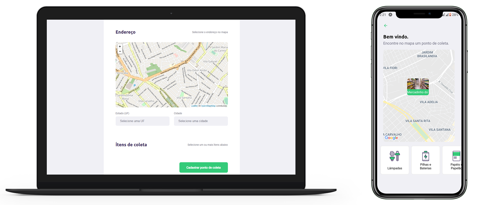

<h1 align="center">
    
</h1>

<h4 align="center">
  :recycle: Next Level Week #1
</h4>

<p align="center">
  

  
  
  <a href="https://github.com/apsampaio/next-level-week-1/commits/master">
    
  </a>

  <a href="https://github.com/apsampaio/next-level-week-1/issues">
    
  </a>
</p>

<p align="center">
  <a href="#rocket-tecnologias"> :rocket: Tecnologias</a>&nbsp;&nbsp;&nbsp;|&nbsp;&nbsp;&nbsp;
  <a href="#computer-projeto">:computer: Projeto</a>&nbsp;&nbsp;&nbsp;|&nbsp;&nbsp;&nbsp;
  <a href="#raised_hands-como-contribuir">:raised_hands: Como Contribuir</a>&nbsp;&nbsp;&nbsp;|&nbsp;&nbsp;&nbsp;
  <a href="#octocat-como-executar">:octocat: Como Executar</a>&nbsp;&nbsp;&nbsp;
</p>

<br>

<p align="center">
  
</p>

## :rocket: Tecnologias

Esse projeto foi desenvolvido com as seguintes tecnologias:

- [Node.js](https://nodejs.org/en/)
- [React](https://reactjs.org)
- [React Native](https://facebook.github.io/react-native/)
- [TypeScript](https://www.typescriptlang.org/)
- [Expo](https://expo.io/)

## :computer: Projeto

O Ecoleta é um projeto para tornar fácil a visualização de locais de coletas de recicláveis como Eletrônicos, orgânicos entre outros.

## :raised_hands: Como contribuir

- Faça um fork desse repositório;
- Cria uma branch com a sua feature: `git checkout -b minha-feature`;
- Faça commit das suas alterações: `git commit -m 'feat: Minha nova feature'`;
- Faça push para a sua branch: `git push origin minha-feature`.

Depois que o merge da sua pull request for feito, você pode deletar a sua branch.

## :octocat: Como Executar

#### Clonando o projeto

```sh
git clone https://github.com/apsampaio/next-level-week-1.git
cd next-level-week-1
```

#### Iniciando Backend

```sh
cd backend
npm install
npm start
```

#### Iniciando Frontend

```sh
cd frontend
npm install
npm start
```

#### Iniciando mobile

```sh
cd mobile
npm install
npm start
```

---

Feito com ♥ by Andre Sampaio :wave:
